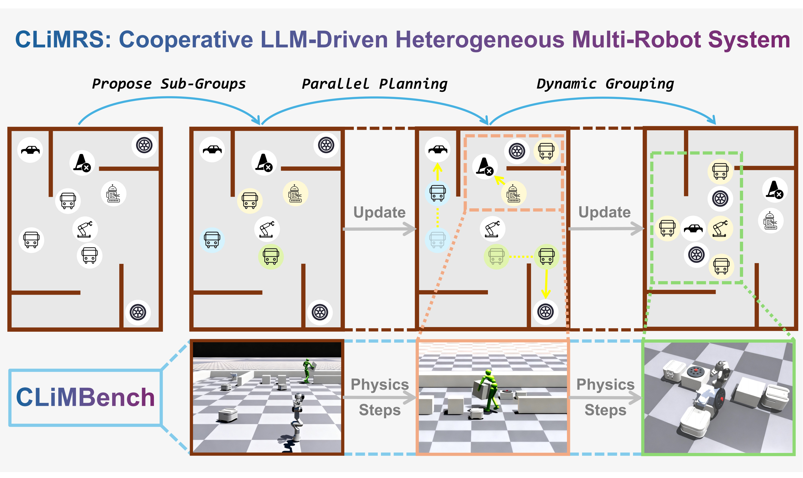

# CLiMRS: Cooperative Large-Language-Model-Driven Heterogeneous Multi-Robot System

<div align="center">


</div>


<div style="text-align: center;">
    
</div>


## Installation

Download Isaac Gym from [website](https://developer.nvidia.com/isaac-gym), or using CLI commands:

```bash
wget https://developer.nvidia.com/isaac-gym-preview-4
tar -xvzf isaac-gym-preview-4
```

Create conda environment:

```bash
conda create -n climrs python=3.8
conda activate climrs
```

Install IsaacGym wrappers for Python:

```bash
pip install -e isaacgym/python
```

Install other dependencies:

```bash
pip install -r requirements.txt
```
If encountering following error: `ImportError: libpython3.8m.so.1.0: cannot open shared object file: No such file or directory`, you need set the environment variables:

```bash
export LD_LIBRARY_PATH=/path/to/conda/envs/your_env/lib
```

## Commands

### Reproduce Results for our Paper


```bash
conda activate climrs
python climrs/run.py
```
